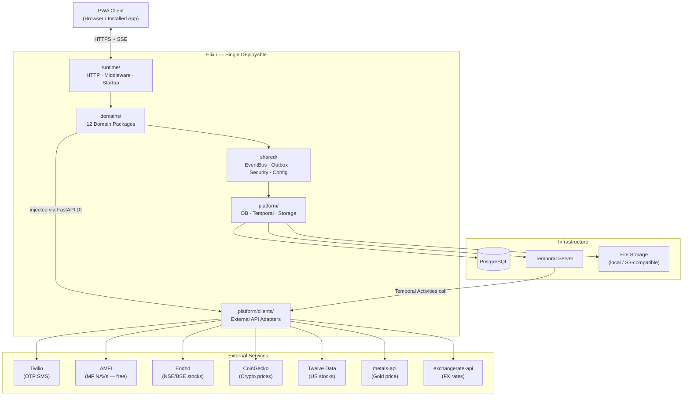

# Elixir — Architecture Overview

Elixir is a multi-user personal finance PWA for tracking earnings, expenses, investments, and peer balances. It targets Indian users (INR primary, multi-currency with conversion) and supports all major investment instrument types. Users upload bank or credit card statements; an AI agent categorises transactions, asks for clarification when uncertain, and builds a running financial picture across accounts, categories, and time.

This is the entry point for the documentation. Read it first, then follow the links to go deeper.

---

## System Diagram



---

## Architecture Pattern: Modular Monolith

Elixir is a **single deployable unit** structured internally as 12 independent domain packages. There are no microservices and no inter-service network hops. Each domain:

- owns its own database tables — no other domain may write to them directly
- exposes SQL views for cross-domain read-only queries
- publishes domain events when its state changes in a way other domains must react to
- subscribes to events published by other domains via the in-process `EventBus`

This gives the clean domain isolation of microservices without the operational overhead. If a domain ever needs to be extracted into an independent service, the contracts (events, views, service interfaces) are already defined — only the transport changes. See [ADR-0001](adr/0001-modular-monolith.md).

---

## Internal Layer Structure

All application code lives in `src/elixir/` split into four packages:

| Package | What it is | Responsibility |
|---|---|---|
| `runtime/` | How the app runs | FastAPI app factory, middleware pipeline, startup/shutdown lifecycle |
| `platform/` | External system adapters | DB engine + session factory, Temporal client, file storage, external API clients |
| `shared/` | Infrastructure domains may use | EventBus, outbox poller, security utilities, config, SQLAlchemy base, common exceptions |
| `domains/` | All business logic | 12 self-contained domain packages |

**The rule domains must follow**: import from `shared/` and (via DI) `platform/clients/` only. Never import from `runtime/`. Never import from another domain's `models`, `services`, or `repositories`. See [ADR-0008](adr/0008-runtime-platform-shared-layers.md) and [project-structure.md](project-structure.md) for the full import table.

---

## Technology Stack

| Technology | Role | Why |
|---|---|---|
| **FastAPI** (Python 3.13) | HTTP API, SSE streaming | Async-first, native SSE for statement streaming, Pydantic validation, auto OpenAPI docs |
| **PostgreSQL** | Sole datastore | ACID guarantees for financial data, RLS for multi-tenant security, JSONB, pg_trgm for search — no extra infra needed |
| **Google ADK** | AI categorisation agent | Tool-use capability lets the agent look up categories and ask the user questions mid-workflow; stateful multi-turn per job |
| **Temporal** | Durable workflow orchestration | Human-in-the-loop signals, scheduled jobs, crash-safe resume, built-in Temporal UI for visibility |
| **Twilio** | OTP SMS delivery | Reliable carrier routing in India, delivery receipts, retry handling |
| **PWA** | Frontend | Single codebase for mobile and desktop, installable on home screen, no App Store |
| **pdfplumber + camelot** | PDF parsing | `pdfplumber` for text-layer PDFs; `camelot` for table-heavy or borderline scanned PDFs |
| **Alembic** | DB schema migrations | Standard SQLAlchemy tool; migrations live alongside domain code |
| **uv** | Package management | Fast, reproducible lockfile, already configured |

---

## Inter-Domain Communication

Three patterns, in preference order. Using pattern 3 requires explicit justification in code.

### Pattern 1 — SQL Views (read-only cross-domain queries)

When Domain A needs to *read* data owned by Domain B for display or aggregation:

- Domain B defines a named SQL view (e.g. `categories_for_user`, `user_accounts_summary`)
- Domain A queries that view by name using raw SQL — it never references Domain B's underlying tables
- Domain B can restructure its tables freely as long as the view contract stays stable

### Pattern 2 — Domain Events via Outbox (async, durable)

When Domain A completes an operation and Domain B must react asynchronously:

```
1. Domain A writes its event to its own `outbox` table
   IN THE SAME DB TRANSACTION as the business operation
   → if the business operation rolls back, the event row rolls back too — atomicity guaranteed

2. A background poller (shared/outbox.py) reads unprocessed rows every 2 seconds
   and dispatches each event to the shared in-process EventBus

3. Domain B's registered handler runs
   → on success: outbox row is marked `processed`
   → on crash between dispatch and mark: row is re-dispatched on next poll
   → therefore: all event handlers MUST be idempotent
```

See [ADR-0003](adr/0003-outbox-pattern.md).

### Pattern 3 — Direct Service Call (synchronous, explicitly justified)

Only when a synchronous return value is genuinely required and an event-driven approach is impossible. Must be accompanied by a code comment explaining the justification. Should be rare across the codebase.

---

## Key Domain Events

| Publisher | Event | Primary Consumers |
|---|---|---|
| `statements` | `ExtractionCompleted` | `transactions` |
| `transactions` | `TransactionCreated` | `earnings`, `investments`, `budgets` |
| `transactions` | `TransactionCategorized` | `budgets` |
| `investments` | `SIPDetected` | `notifications` |
| `investments` | `ValuationUpdated` | _(future: planning)_ |
| `earnings` | `EarningClassificationNeeded` | `notifications` |
| `budgets` | `BudgetLimitWarning` | `notifications` |
| `budgets` | `BudgetLimitBreached` | `notifications` |
| `identity` | `UserRegistered` | _(future: onboarding)_ |

---

## Security Model

- Every table row carries `user_id`; every query filters by it — no row is accessible without the authenticated user's ID
- PostgreSQL Row-Level Security (RLS) enforces this at the database layer as a second line of defence
- **JWT sessions**: 15-minute access token, 7-day refresh token in an HttpOnly cookie
- **OTP**: 60-second expiry, max 3 attempts, 5-minute lockout on exhaustion
- Bank account numbers and card numbers stored AES-256 encrypted; only `last4` digits in plaintext
- Uploaded statement files stored at user-scoped paths — never publicly accessible URLs
- No PII (phone number, account numbers, card numbers) written to application logs

---

## Navigation

| Document | What it covers |
|---|---|
| [data-model.md](data-model.md) | Tables per domain, cross-domain ID references, data ownership rules |
| [integrations.md](integrations.md) | Every external API: purpose, rate limits, owning domain, fallback |
| [project-structure.md](project-structure.md) | Full directory tree, layer import rules, domain package conventions |
| [domains/](domains/) | One file per domain: tables, events, views, service methods, key decisions |
| [workflows/](workflows/) | Step-by-step Temporal workflow descriptions |
| [adr/](adr/) | Architecture Decision Records — the *why* behind every major decision |
